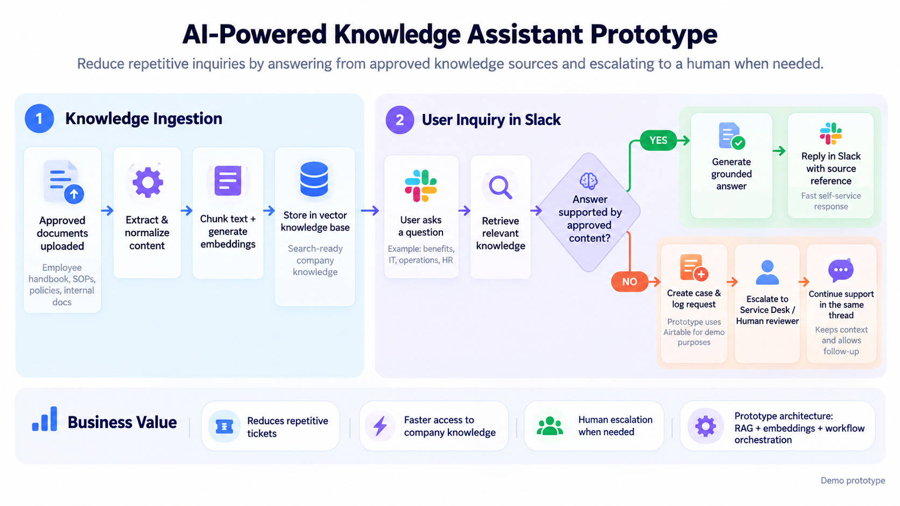

# RAG Support Assistant

AI-powered internal support assistant built with n8n, Retrieval-Augmented Generation (RAG), Slack, Qdrant, Google Drive, Airtable, Google Gemini, and Anthropic Claude.

The system answers employee questions using approved internal knowledge, handles conversational follow-ups, provides source-backed responses, and escalates unsupported requests to a human reviewer.

## Architecture Diagram

---

## Problem

Internal teams often spend significant time repeatedly answering questions that are already documented in policies, employee handbooks, operational guides, and internal knowledge bases.

A generic LLM can answer quickly, but relying on model knowledge alone creates a major problem:

**Company-specific answers can be inaccurate or hallucinated.**

---

## Solution

This project uses Retrieval-Augmented Generation to ground responses in approved internal documents.

The system:

- monitors an approved Google Drive knowledge folder
- extracts text from uploaded PDF documents
- normalizes document metadata
- splits documents into smaller chunks
- generates embeddings
- stores document vectors in Qdrant
- receives employee questions through Slack
- retrieves Slack thread context
- rewrites conversational follow-ups into standalone retrieval questions
- searches the vector database for relevant knowledge
- generates answers using retrieved context
- attaches source metadata to supported responses
- escalates unsupported questions to a human reviewer
- logs escalation cases in Airtable
- tracks escalation state for Slack threads

---

## Architecture

The solution is separated into three modular n8n workflows.

### 1. Knowledge Ingestion

Google Drive  
→ Download Document  
→ Extract PDF Text  
→ Normalize Metadata  
→ Recursive Text Splitting  
→ Generate Embeddings  
→ Store in Qdrant

The ingestion workflow automatically processes new documents added to the approved knowledge folder.

### Chunking Strategy

- Chunk size: `800`
- Chunk overlap: `150`

Document metadata such as source file, document title, version, and source URL is retained for retrieval and source attribution.

---

### 2. Slack RAG Assistant

Slack App Mention  
→ Normalize Message  
→ Retrieve Slack Thread Context  
→ Rewrite Follow-Up Question  
→ Qdrant Vector Search  
→ Build Retrieval Context  
→ LLM Answerability Check  
→ Grounded Answer or Escalation

The workflow uses Slack thread context to understand conversational follow-ups and rewrites them into standalone retrieval questions before vector search.

---

### 3. Human Escalation

Unsupported Question  
→ Prepare Escalation Payload  
→ Create Airtable Case  
→ Save Escalation State  
→ Notify Human Reviewer in Slack

When the approved knowledge base does not contain sufficient evidence, the assistant does not fabricate an answer.

Instead, the request is routed to a human reviewer and logged as an escalation case.

---

## Hallucination Control

The answer model is instructed to use only retrieved business knowledge for company-specific facts.

If the retrieved context is:

- insufficient
- ambiguous
- unsupported
- unrelated to the question

the workflow escalates the request instead of generating an unsupported answer.

This keeps humans involved when the AI does not have enough reliable information.

---

## Human-in-the-Loop Design

Once a Slack thread has been escalated, the workflow tracks the escalation state.

Future messages in the same thread can be classified as either an existing case follow-up or a new business knowledge question.

This prevents an existing support case from being unnecessarily processed again as a new RAG request.

---

## Tech Stack

- n8n
- Retrieval-Augmented Generation (RAG)
- Qdrant Vector Database
- Google Gemini Embeddings
- Google Gemini LLM
- Anthropic Claude
- Slack API
- Airtable API
- Google Drive
- JavaScript
- REST APIs
- JSON

---

## Workflow Files

Sanitized n8n workflow exports are available in the `workflows/` directory.

### 01 — Knowledge Ingestion

`workflows/01-knowledge-ingestion.json`

Handles document ingestion, text extraction, chunking, embeddings, metadata, and vector storage.

### 02 — Slack RAG Assistant

`workflows/02-slack-rag-assistant.json`

Handles Slack questions, conversation context, retrieval, grounded responses, and escalation routing.

### 03 — Human Escalation

`workflows/03-human-escalation.json`

Handles escalation case creation, Airtable logging, and human review routing.

---

## Security

The public workflow exports have been sanitized.

This repository does not include:

- API keys
- OAuth tokens
- passwords
- credential bindings
- private webhook IDs
- private Airtable base IDs
- private Slack workspace identifiers
- production environment secrets

---

## Status

Portfolio prototype demonstrating:

- RAG architecture
- vector retrieval
- LLM orchestration
- conversational retrieval
- grounded answer generation
- workflow decomposition
- human-in-the-loop escalation
- business system integration
